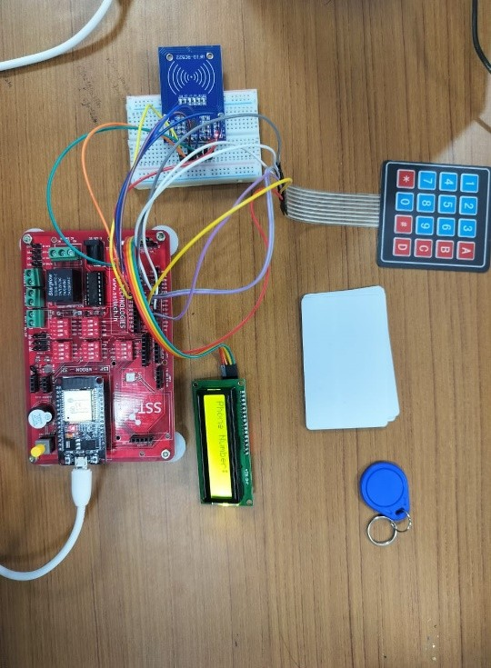
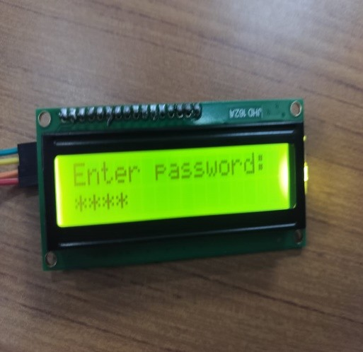

# Smart Trolley Project

---

**Smart Trolley** is a full-stack IoT-enabled shopping cart system integrating hardware (ESP32 + RFID) and software (Node.js backend + Firebase + Web frontend). Users can manage carts, view transaction history, and check balances, while admins can manage user accounts.It uses three firestore collections.

---

## Hardware Setup Images

  
*Figure 1: ESP32 with RFID reader connection diagram*

  
*Figure 2: Complete trolley assembly with mounted components*

---

## Project Overview

### Hardware (ESP32 & RFID)
- Each cart has an ESP32 and RFID reader.
- Scanned items are sent to the backend in real-time.

### Backend
- Node.js server communicates with Firebase Firestore.
- Handles authentication, cart operations, transactions, and admin functions.
- Implements a Backend-for-Frontend (BFF) controller under `/frontend`.
- JWT-based authentication secures frontend requests.
- Serves frontend static files from `/public`.

### Frontend
- Single-page application using **vanilla JS**.
- Views: Login/Register, Cart, Transaction History, User Profile.
- Interacts with backend via `/frontend` routes using JWT.

---

## Setup Instructions

### Prerequisites
- Node.js >= 18
- Firebase project with Firestore
- Arduino IDE for ESP32
- Hardware: ESP32, RFID reader, jumper wires, power source

---

### Hardware Setup (ESP32 + RFID)

1. **Assemble Hardware**  
   Setup the hardware as shown in Figure 1 above.

2. **Configure WiFi Credentials**  
   Open the Arduino code and update your WiFi credentials:
   ```cpp
   const char* ssid = "YOUR_WIFI_SSID";
   const char* password = "YOUR_WIFI_PASSWORD";
   ```

3. **Upload Firmware**  
   Upload the firmware to ESP32 via Arduino IDE.

4. **Test Connection**  
   Test RFID scanning and backend connectivity via serial monitor.

---

### Backend Setup

1. **Create Environment File**  
   Create a `.env` file in the `backend/` directory with your JWT secret key:
   ```env
   JWT_SECRET=your_jwt_secret_key
   ```

2. **Install Dependencies**  
   Navigate to the backend folder and install Node.js dependencies:
   ```bash
   cd backend
   npm install
   ```

3. **Configure Firebase**  
   - Obtain your Firebase Service Account Key JSON file from the [Firebase Console](https://console.firebase.google.com/).
   - Save it in your backend folder (e.g., `backend/serviceAccountKey.json`).
   - Ensure the following Firestore collections exist:
     - `registered users`
     - `ongoing shopping data`
     - `transaction history`

4. **Run Backend Server**  
   Start the Node.js backend server:
   ```bash
   npm start
   ```
   The server should now be running on `http://localhost:5000` (or your configured port).

---

